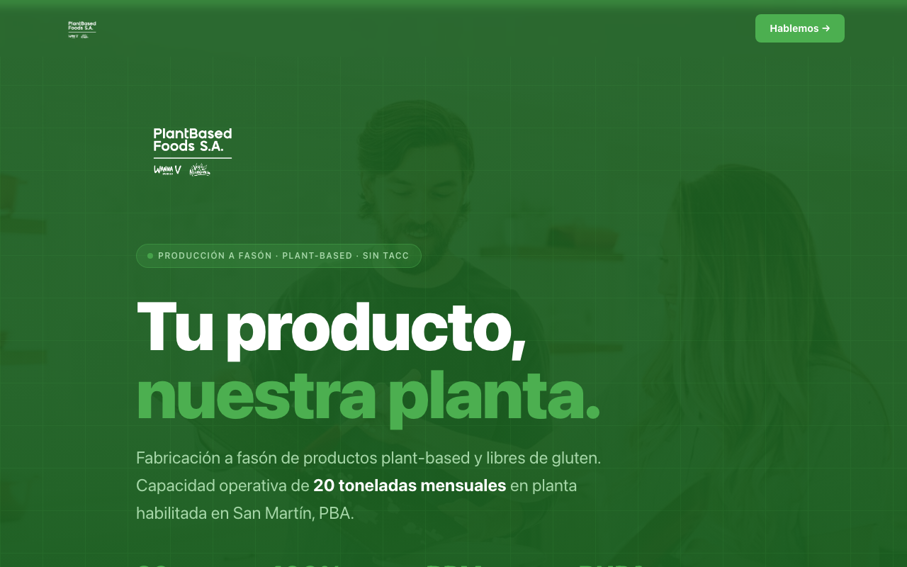

# 🏭 PBF Copacking — Landing B2B

Landing de captación para el servicio de **producción a fasón** de Plant Based Foods S.A., un copacker especializado en productos plant-based y libres de gluten.

**Sitio en vivo:** https://juancasareto.github.io/pbf-copack/



## El proyecto

**Cliente:** Plant Based Foods S.A. — planta operativa en San Martín, PBA.
**Audiencia:** B2B — marcas, emprendedores y fabricantes del sector alimentario que necesitan un copacker.
**Objetivo:** captar leads calificados y llevarlos a completar el formulario de contacto para iniciar la conversación comercial.

El desafío no era vender comida: era transmitir **capacidad industrial y confianza** a alguien que va a poner su fórmula en manos de un tercero. Por eso el sitio se estructura alrededor de proceso, capacidad y garantías, no de fotos de producto.

## Qué construí

Single-page con 11 secciones, pensada como un recorrido de objeciones:

| Sección | Qué resuelve |
|---|---|
| **Hero** | Propuesta de valor + 4 métricas duras (20 tn/mes, 100% sin TACC, BPM, RNPA) |
| **Servicios** | Bifurca la audiencia en dos tracks: "ya tengo fórmula" vs "empiezo de cero" |
| **Productos** | Qué se puede fabricar hoy y qué está en desarrollo |
| **Diferenciales** | Ataca las objeciones típicas: confidencialidad, mínimos, contaminación cruzada |
| **Proceso** | Los 7 pasos del proyecto, para eliminar la incertidumbre del "¿y ahora qué?" |
| **Marcas propias** | Prueba de que la planta fabrica sus propias marcas — el mejor aval posible |
| **Prueba social + ticker** | Clientes actuales |
| **Formulario** | Captura con segmentación por servicio de interés |

## Decisiones de diseño

- **Tono técnico e industrial**, sin estética lifestyle — es una decisión del brief: el comprador es un fabricante, no un consumidor final.
- **Foco en planta, proceso y equipo** por sobre fotos de comida.
- **Paleta de verdes de marca**, alineada con vegabundancia.com.
- **Motion con propósito**: parallax en el hero y animaciones de entrada por sección con `framer-motion`, para dar ritmo al scroll sin distraer del contenido.

## Stack

- **React 19 + TypeScript** sobre **Vite**
- **framer-motion** — animaciones y parallax
- **lucide-react** — iconografía
- Deploy automático a GitHub Pages vía GitHub Actions

## Correr localmente

```sh
npm install
npm run dev      # servidor de desarrollo
npm run build    # build de producción
npm run lint     # ESLint
npm run preview  # previsualizar el build
```

## Estructura

```
src/
  components/    → una sección por componente (Hero, Servicios, Proceso, ...)
  App.tsx        → composición de la página
  index.css      → estilos globales y tokens de marca
public/          → logos, iconos y la imagen de Open Graph
.github/workflows/ → build y deploy a GitHub Pages
```

> El deploy usa `base: '/pbf-copack/'` en `vite.config.ts` para que los assets resuelvan bajo la subruta de GitHub Pages.

---

*Proyecto desarrollado con [Easy Crew AI](https://juancasareto.github.io/teambuilder/), organizando el trabajo en un equipo de agentes especializados (PM, frontend, UX, motion y psicología del consumidor).*
